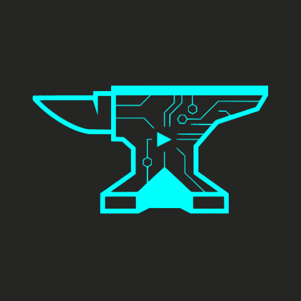

# AniForge

  

**AniForge** — особистий трекер аніме для Android: швидкий, офлайн і зроблений так, як ти насправді дивишся аніме.

Жодних акаунтів. Жодної хмари. Просто відкрий застосунок і починай.

---

## Що можна робити?

### 📋 Відстежуй своє аніме
Організовуй усе, що дивишся, у списки — **Дивлюся**, **Переглянуто**, **Заплановано**, **Призупинено** та **Покинуто**. Оновлюй прогрес одним дотиком і знай, де зупинився.

### 🔍 Переглядай повний каталог
Досліджуй вбудований каталог аніме, який працює повністю офлайн. Фільтруй за жанром, тегом або студією, щоб знайти саме те, що шукаєш — без інтернету.

### 🌳 Слідкуй за франшизами та продовженнями
Більше не губись у серіях. AniForge будує карту приквелів, сиквелів і спін-офів, щоб ти бачив повну картину франшизи в одному місці.

### 🏠 Дивись, що відбувається, одним поглядом
Головний екран показує нещодавню активність, що ти зараз дивишся, і швидкі переходи до твоїх списків.

### 🖼️ Детальна інформація про аніме
Кожне аніме має повну сторінку з обкладинкою, описом, кількістю серій, жанрами, тегами, інформацією про студію та багато іншого.

---

## Що планується далі?

- **Віджети головного екрана** — бачи своє поточне аніме прямо з домашнього екрана Android
- **Кнопка швидкого відмічення серії** — один дотик, щоб відмітити переглянутий епізод прямо з віджета
- **Сповіщення про сиквели** — отримуй сповіщення, коли оголошується або виходить сиквел чогось, що ти вже переглянув
- **Налаштований дашборд** — переставляй блоки головного екрана так, як тобі зручно

---

## Вимоги

- Android 12 або новіший

---

## 🌐 Підтримувані мови

- 🇺🇦 Українська
- 🇬🇧 Англійська

---

## 🙏 Подяки

AniForge не був би можливим без цих чудових проєктів:

- [**AniList**](https://anilist.co) — основне джерело інформації про аніме, метаданих і каталогу
- [**Hikka**](https://hikka.io) — українські назви аніме та переклади
- [**TMDB** (The Movie Database)](https://www.themoviedb.org) — скриншоти та зображення аніме

---

## Ліцензія

MIT License — деталі у файлі [LICENSE](./LICENSE).  
Copyright © 2026 GetTheNya
